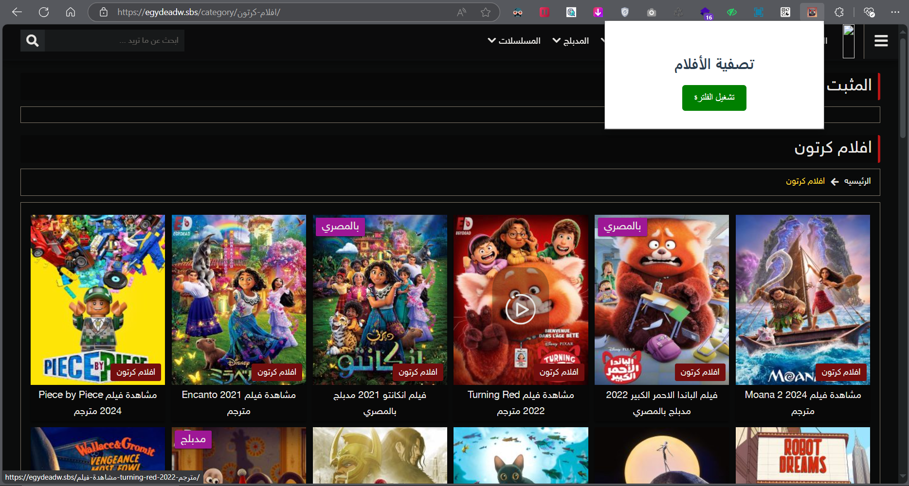
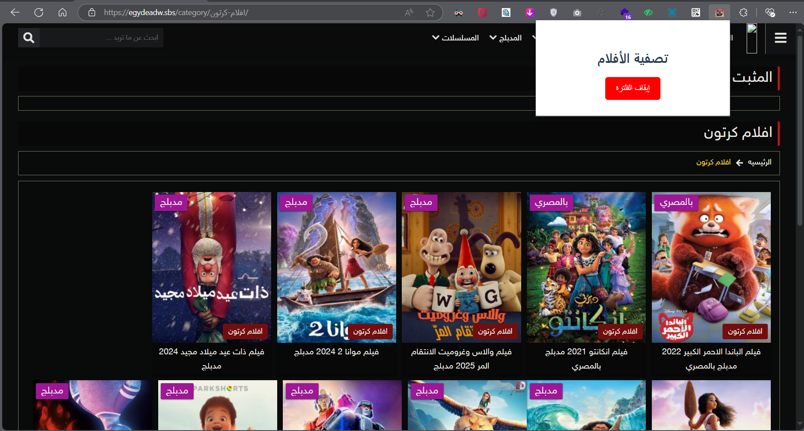

# فلتر الأفلام - Movie Filter Extension 🎬✨

فلتر الأفلام هو إضافة لمتصفح Chrome تقوم بتصفية وعرض الأفلام المدبلجة فقط من موقع **egydeadw.sbs** في قسم الأفلام الكرتونية. 🎥

## المميزات 🌟

- تصفية الأفلام المدبلجة فقط عند التفعيل.
- زر لتشغيل وإيقاف الفلتر.
- تحديث الصفحة تلقائيًا بعد تغيير حالة الفلتر.
- تغيير لون الزر بين الأخضر والأحمر بناءً على حالة الفلتر.
- دعم التصفح على صفحات معينة فقط.

## كيفية التثبيت 🔧

1. قم بتحميل أو استنساخ هذا المشروع على جهازك.
2. افتح متصفح Chrome.
3. اذهب إلى `chrome://extensions/`.
4. قم بتفعيل خيار "وضع المطور" في أعلى الصفحة.
5. اختر "تحميل الإضافة غير مضغوطة" (`Load unpacked`).
6. اختر المجلد الذي يحتوي على ملفات الإكستنشن.

## صورة قبل وبعد الاستخدام 📸

### قبل الاستخدام: 
  

### بعد الاستخدام:
  

## كيفية الاستخدام 🛠️

- بمجرد تثبيت الإكستنشن، ستظهر أيقونة الإكستنشن في شريط الأدوات.
- يمكنك الضغط على الأيقونة لتفعيل أو إيقاف الفلتر.
- عند التفعيل، ستظهر الأفلام المدبلجة فقط، وسيصبح الزر باللون الأخضر.
- عند الإيقاف، سيتم عرض جميع الأفلام ويصبح الزر باللون الأحمر.

### فيديو توضيحي 🎥

يمكنك مشاهدة الفيديو التالي لتوضيح كيفية استخدام الإكستنشن:

  <!-- اضغط هنا لتعديل رابط الفيديو وصورة الفيديو -->

## التقنيات المستخدمة 🔧

- **JavaScript**: لاستخدام الـ Chrome Extensions API.
- **HTML/CSS**: لتصميم واجهة المستخدم.
- **Chrome Storage API**: لتخزين حالة الفلتر.
- **Chrome Tabs API**: للتفاعل مع التبويبات المفتوحة.

## المساهمات 🤝

إذا كنت ترغب في المساهمة في تحسين هذا الإكستنشن، لا تتردد في فتح **Issue** أو تقديم **Pull Request**.

## الترخيص 📝

مفتوح المصدر تحت رخصة MIT.

